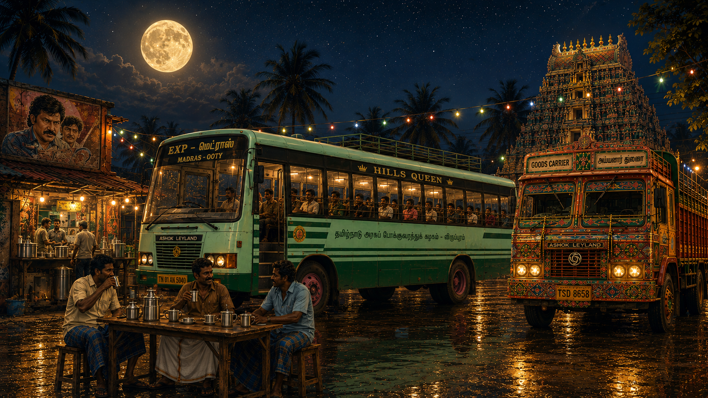

# தமிழ் பயணம் — Tamizh Payanam

<div align="center">



### *ஒரு பயணம். ஆயிரம் கதைகள்.* — (One Journey. A Thousand Stories.)

An atmospheric, retro-futuristic web experience celebrating the culture, music, cinema, literature, geography, and nostalgia of Tamil Nadu aboard a night government bus.

[](https://reactjs.org/)
[](https://vitejs.dev/)
[](https://github.com/pmndrs/zustand)
[](https://greensock.com/gsap/)
[](https://www.framer.com/motion/)
[](https://developer.mozilla.org/en-US/docs/Web/API/Web_Audio_API)
[](https://developers.google.com/youtube/iframe_api_reference)
[](./LICENSE)

</div>

---

## 📖 Table of Contents

- [🚌 About The Project](#-about-the-project)
- [✨ Key Features](#-key-features)
- [🗺️ The 6 Iconic Routes](#️-the-6-iconic-routes)
- [🎮 Interactive Controls & Shortcuts](#-interactive-controls--shortcuts)
- [🛠️ Tech Stack & Architecture](#️-tech-stack--architecture)
- [📁 Project Structure](#-project-structure)
- [🚀 Quick Start & Installation](#-quick-start--installation)
- [🎵 Audio & Web Synthesis Engine](#-audio--web-synthesis-engine)
- [🤝 Contributing](#-contributing)
- [📄 License](#-license)

---

## 🚌 About The Project

**"தமிழ் பயணம் — Tamizh Payanam"** (Repository: `Oru-Payanam-Aayiram-Kathaigal`) is an immersive aesthetic web application that frames cultural exploration through a nocturnal journey departing from **Villupuram Depot** aboard an authentic **TNSTC (Tamil Nadu State Transport Corporation)** express bus traveling across iconic regions of Tamil Nadu.

The experience fuses hand-crafted vector graphics, real engine audio loops, Web Audio API sound design, retro radio cassette tape decks with YouTube streaming, Zustand state persistence, interactive window vignettes, and CRT monitor aesthetics.

---

## ✨ Key Features

- 🚌 **Authentic TNSTC Villupuram Express**: Custom SVG vector bus model complete with working wipers, headlights, indicator blinkers, side mirrors, and rearview reflections.
- 🎛️ **Interactive Cockpit & Switches**: Toggle Ignition (`IGN`), Headlights (`HEAD`), Left/Right Indicators (`IND`), Audio Mute (`SND`), and Ambient Sounds (`AMB`).
- 📻 **Tamizh Retro Radio & Cassette Rack**: Fully playable cassette player loaded with curated Tamil soundtracks (Ilaiyaraaja, AR Rahman, Retro Classics, Devotional, Folk, Indie) and fast-travel destination tapes.
- 🎟️ **Collectible Vintage Bus Ticket**: Authentic printed stub detailing route numbers, fares, seats, and conductor stamps. Click to flip and track journey achievements across all 6 regions.
- 📖 **Cultural Vignettes & Encyclopedia**: In-depth stories, history, cuisine, literature, and architectural highlights for every stop on the journey.
- 🔊 **Procedural Web Audio & Engine Soundscape**: Recorded diesel engine idling, pneumatic air horn (*"கோவிந்தா! / HORN OK PLEASE"*), conductor call bell, indicator clicks, and spatial wind/rain ambience.
- 📺 **CRT Retro Monitor Overlay**: Vintage television line overlay, scanline toggles, and immersive dark mode styling.

---

## 🗺️ The 6 Iconic Routes

| ID | Destination (English) | Destination (Tamil) | Route No. | Fare | Bus Class | Radio Frequency | Highlights |
|:--:|:---|:---|:---:|:---:|:---:|:---:|:---|
| **0** | **Chennai** | சென்னை | `127` | ₹185 | `GEN` | `FM 93.5` | Marina Beach, George Town, Kapaleeshwarar Temple, Fort St. George |
| **1** | **Thanjavur** | தஞ்சாவூர் | `54A` | ₹142 | `SIT` | `MW 729` | Brihadeeswarar Temple, Tanjore Palace, Saraswathi Mahal, Tanjore Paintings |
| **2** | **Madurai** | மதுரை | `7` | ₹218 | `SIT` | `FM 101.9` | Meenakshi Amman Temple, Thirumalai Nayakkar Palace, Teppakulam, Jasmine Market |
| **3** | **Kanyakumari** | கன்னியாகுமரி | `49` | ₹340 | `EXP` | `FM 107.0` | Vivekananda Rock Memorial, Thiruvalluvar Statue, Kumari Amman Temple, Triveni Sangam |
| **4** | **Nilgiris** | நீலகிரி | `12` | ₹276 | `EXP` | `FM 91.1` | Ooty Lake, Botanical Gardens, Doddabetta Peak, Nilgiri Mountain Railway |
| **5** | **Cauvery Delta** | காவிரி டெல்டா | `36B` | ₹98 | `GEN` | `FM 88.4` | Kumbakonam Temples, Mahamaham Tank, Darasuram, Gangaikondacholapuram |

---

## 🎮 Interactive Controls & Shortcuts

| Key / Action | Action Description |
|:---|:---|
| <kbd>H</kbd> | Sound Pneumatic Air Horn (*கோவிந்தா! / HORN OK PLEASE*) + Screen Flash Effect |
| <kbd>D</kbd> | Toggle Developer Telemetry HUD |
| <kbd>F</kbd> | Toggle Fullscreen Journey Mode |
| **Click Windows** | Open "Outside the Window" city vignettes drawer |
| **Click Ticket** | Flip ticket to view region completion checklist |
| **Click Call Bell** | Ring conductor call bell (*🔔 அடுத்த நிறுத்தம்!*) |
| **Click Rearview Mirror** | Trigger side mirror reflection easter egg |
| **Dashboard Switches** | Ignition (`IGN`), Headlights (`HEAD`), Indicators (`◀ IND` / `IND ▶`), Mute (`SND`), Ambience (`AMB`) |
| **Cassette Rack** | Select curated music cassettes or unlocked regional tapes |
| **Hide Bus Toggle** | Zen mode for unobstructed scenery view and background ambient music |

---

## 🛠️ Tech Stack & Architecture

- **Frontend Core**: [React 18](https://reactjs.org/) + [Vite 5](https://vitejs.dev/)
- **State Management**: [Zustand](https://github.com/pmndrs/zustand) with `localStorage` persistence
- **Animation & FX**: [GSAP 3](https://greensock.com/gsap/) + [Framer Motion](https://www.framer.com/motion/)
- **Audio Synthesizer**: [Howler.js](https://howlerjs.com/) + Web Audio API (procedural synthesis)
- **Media Streaming**: YouTube IFrame API (Custom Retro Radio cassette engine)
- **Styling**: Vanilla CSS3 + Custom SVG vector graphics + CSS Grid/Flexbox

---

## 📁 Project Structure

```
tamizh-payanam/
├── public/                      # Static media assets & sound files
│   └── lesiakower-diesel-idle.mp3 # High-quality diesel engine idle audio
├── src/
│   ├── assets/                  # Images, background textures, and icons
│   ├── audio/
│   │   └── sound.js             # Web Audio API procedural synthesizer & spatial sound engine
│   ├── components/
│   │   ├── BusTicket.jsx        # Interactive bus ticket stub & checklist
│   │   ├── ContentPanel.jsx     # Slide-in cultural encyclopedia drawer
│   │   ├── CRTOverlay.jsx       # Vintage CRT monitor scanline overlay
│   │   ├── Dashboard.jsx        # Cockpit switches, digital speedometer & fuel gauge
│   │   ├── DestinationBoard.jsx # Route destination LED display board
│   │   ├── HornButton.jsx       # Interactive horn control button
│   │   ├── Intro.jsx            # Launch screen & welcome modal
│   │   ├── Kolam.jsx            # Traditional Tamil kolam SVG vector artwork
│   │   ├── NightScene.jsx       # Parallax nocturnal environment background
│   │   ├── Road.jsx             # Dynamic animated road surface component
│   │   ├── RouteSelector.jsx    # Destination route buttons with engine interlock
│   │   ├── Sky.jsx              # Dynamic celestial night sky component
│   │   ├── TamizhRadio.jsx      # Retro radio deck & YouTube player engine
│   │   ├── TapeRack.jsx         # Cassette rack for audio tracks & route unlocks
│   │   └── TNSTCBus.jsx         # SVG vector model of TNSTC Express bus
│   ├── data/
│   │   ├── routes.js            # Route definitions, fares, radio frequencies & tapes
│   │   └── stories.js           # Cultural story narratives for all 6 regions
│   ├── store/
│   │   └── useStore.js          # Central Zustand state store with persistence
│   ├── App.jsx                  # Master viewport layout & keyboard event listeners
│   ├── main.jsx                 # React DOM entry point
│   └── index.css                # Global CSS styling & design tokens
├── package.json                 # Project dependencies & npm scripts
└── vite.config.js               # Vite build configuration
```

---

## 🚀 Quick Start & Installation

### Prerequisites
- **Node.js**: Version 18.0.0 or higher
- **npm**: Version 9.0.0 or higher

### Step-by-Step Setup

```bash
# 1. Clone the repository
git clone https://github.com/theflighttechofficial/Oru-Payanam-Aayiram-Kathaigal.git

# 2. Navigate to project directory
cd tamizh-payanam

# 3. Install dependencies
npm install

# 4. Start local dev server
npm run dev

# 5. Open local preview
# Navigate to http://localhost:5173 in your web browser
```

### Build Commands

```bash
# Build production bundle
npm run build

# Preview production build locally
npm run preview
```

---

## 🎵 Audio & Web Synthesis Engine

*Tamizh Payanam* combines three distinct sound systems to create an authentic audio environment:
1. **Procedural Web Audio API**: Generates real-time air pressure releases, indicator relay ticks, call bell chimes, horn frequencies, and dynamic engine rev pitch shifts.
2. **Recorded Audio Loops**: Real sampled diesel bus engine idling loops managed via Howler.js for seamless playback.
3. **YouTube Cassette Deck**: Custom IFrame integration allowing curated YouTube audio playback styled as physical cassette tapes inserted into a retro dashboard deck.

---

## 🤝 Contributing

Contributions, feedback, and feature suggestions are always welcome!
1. Fork the Project
2. Create your Feature Branch (`git checkout -b feature/AmazingFeature`)
3. Commit your Changes (`git commit -m 'Add some AmazingFeature'`)
4. Push to the Branch (`git push origin feature/AmazingFeature`)
5. Open a Pull Request

---

## 📄 License

Distributed under the **MIT License**. See `LICENSE` for more information.

<p align="center">
  <sub>Made with ❤️ for Tamil culture, cinema, music & vintage transit.</sub><br>
  <b>TNSTC VILLUPURAM · தமிழ்நாடு அரசுப் போக்குவரத்துக்கழகம் · தமிழ் பயணம்</b><br>
  <i>ஒரு பயணம். ஆயிரம் கதைகள். — One Journey. A Thousand Stories.</i>
</p>
